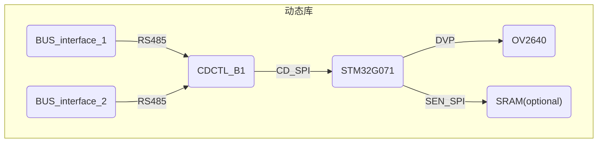

# CDCAM 探究

项目地址: [cdcam](https://github.com/dukelec/cdcam/tree/hw_v1)

## Hardware

原理图:[cdcam_sch_v1.4.pdf](https://github.com/dukelec/cdcam/blob/master/hardware/cdcam_sch_v1.4.pdf)

## Firmware

### app_main

#### load_conf()

这段代码通过Kimi.ai的理解如下:

>结合您提供的两个代码段，我们可以更全面地理解`load_conf`函数的作用和上下文。首先，`csa_dft`是一个`const csa_t`类型的常量结构体实例，它定>义了一组默认的配置值，这些值将被用于初始化或验证加载的配置数据。
>
>以下是`load_conf`函数的详细解释：
>
1. `uint16_t magic_code = *(uint16_t *)APP_CONF_ADDR;`>
   从`APP_CONF_ADDR`地址读取16位的值到`magic_code`变量，用于检查配置数据的魔法数字。
2. `uint16_t conf_ver = *(uint16_t *)(APP_CONF_ADDR + 2);`>
   从`APP_CONF_ADDR`地址加上2的位置读取16位的值到`conf_ver`变量，用于获取配置数据的版本号。
3. `csa = csa_dft;`
   将`csa_dft`的默认配置值复制给`csa`变量。这是在加载外部配置之前，先使用默认配置作为基础。
4. `if (magic_code == 0xcdcd && conf_ver == APP_CONF_VER) { ... }`
   如果读取的魔法数字和版本号与预期的默认值匹配，执行以下操作：
   - 使用`memcpy`函数将从`APP_CONF_ADDR`地址开始的数据复制到`csa`结构体中，直到`_end_save`成员之前的位置。`_end_save`是`csa_t`结构体中定义的一个特殊成员，用于标识需要保存的配置数据的结束位置。
   - 将`csa`结构体中的`conf_from`成员设置为1，表示配置是从有效的外部来源加载的。
5. `else if (magic_code == 0xcdcd && (conf_ver >> 8) == (APP_CONF_VER >> 8)) { ... }`
   如果读取的魔法数字正确，但版本号只有高8位与预期的默认值匹配（可能表示轻微的版本差异），执行以下操作：
   - 使用`memcpy`函数将从`APP_CONF_ADDR`地址开始的数据复制到`csa`结构体中，直到`_end_common`成员之前的位置。`_end_common`是`csa_t`结构体中定义的另一个特殊成员，用于标识通用配置数据的结束位置。
   - 将`csa`结构体中的`conf_from`成员设置为2，表示配置是从外部来源加载的，但可能存在版本差异。
   - 更新`csa`结构体中的`conf_ver`成员为`APP_CONF_VER`，确保版本号是最新的。
6. `if (csa.conf_from) ...`
   如果`csa`结构体的`conf_from`成员不为0（即配置已经从外部加载），则将`csa`结构体中的`do_reboot`成员及其后两个字节清零。这可能是用于重置或禁用自动重启的标志。
>
>整体来看，`load_conf`函数的作用是尝试从`APP_CONF_ADDR`地址加载配置数据到`csa`结构体。如果加载成功或部分成功，它会更新`csa`结构体的相应成员，并根据配置的来源设置`conf_from`标志。如果配置加载存在问题，它将回退到使用默认配置`csa_dft`。

关于`APP_CONF_ADDR`地址, 实际是MCU内部flash的一个地址:

