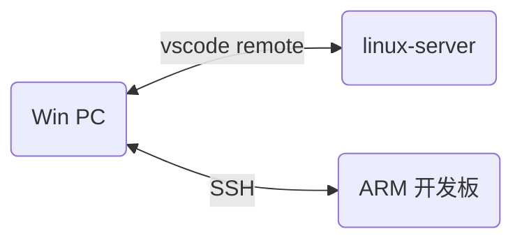

# 交叉编译Hello程序

---

## 开发环境



服务器(linux-server):

```sehll
    finchee@linux-server:~/Documents/hello$ uname -a
    Linux linux-server 6.5.0-35-generic #35~22.04.1-Ubuntu SMP PREEMPT_DYNAMIC Tue May  7 09:00:52 UTC 2 x86_64 x86_64 x86_64 GNU/Linux
```

ARM 开发板: [tspi-raspios](https://lckfb.com/project/detail/lctspi-2g-16g?param=baseInfo)

## Hello 程序解析

``` C
    #include <stdio.h>

    // argc: argument count argv: argument value
    int main(int argc, char **argv)
    {
    if(argc >= 2)
        printf("Hello, %s!\n", argv[1]);
    else
        printf("Hello, world\n");
    return 0;
    }
```

如果提供了至少一个命令行参数（不包括程序名），它将打印出"Hello, [参数]!"。  
如果没有提供命令行参数，它将打印出"Hello, world!"。

argv[0] 指向 hello  
argv[1] 指向第二个参数  

## 服务器执行 gcc 编译的 hello

```shell
    finchee@linux-server:~/Documents/hello$ gcc -o hello hello.c
    finchee@linux-server:~/Documents/hello$ ./hello finchee
    Hello, finchee!
    finchee@linux-server:~/Documents/hello$ ./hello finchee how are you?
    Hello, finchee!
    finchee@linux-server:~/Documents/hello$ ./hello "finchee how are you?"
    Hello, finchee how are you?!
    finchee@linux-server:~/Documents/hello$ 
```

## ARM 开发板上执行 gcc 编译的 hello

```shell
    finchee@raspberrypi:~/Documents/hello $ sudo ./hello
    sudo: ./hello: command not found
    finchee@raspberrypi:~/Documents/hello $ file hello
    hello: ELF 64-bit LSB pie executable, x86-64, version 1 (SYSV), dynamically linked, interpreter /lib64/ld-linux-x86-64.so.2, BuildID[sha1]=e2ced6fb612db420eab030c1e3d26f34c30d1843, for GNU/Linux 3.2.0, not stripped
```

## ARM 开发板上执行交叉编译工具链编译的 hello

### 安装 ARM 交叉编译工具链

服务器中安装 ARM 交叉编译工具链:

```shell
    finchee@linux-server:/usr/bin$ sudo apt-get install gcc-arm-linux-gnueabihf
```

确认是否安装成功

```shell
    finchee@linux-server:/usr/bin$ arm-linux-gnueabihf-gcc -v
    Using built-in specs.
    COLLECT_GCC=arm-linux-gnueabihf-gcc
    COLLECT_LTO_WRAPPER=/usr/lib/gcc-cross/arm-linux-gnueabihf/11/lto-wrapper
    Target: arm-linux-gnueabihf
    Configured with: ../src/configure -v --with-pkgversion='Ubuntu 11.4.0-1ubuntu1~22.04' --with-bugurl=file:///usr/share/doc/gcc-11/README.Bugs --enable-languages=c,ada,c++,go,d,fortran,objc,obj-c++,m2 --prefix=/usr --with-gcc-major-version-only --program-suffix=-11 --enable-shared --enable-linker-build-id --libexecdir=/usr/lib --without-included-gettext --enable-threads=posix --libdir=/usr/lib --enable-nls --with-sysroot=/ --enable-clocale=gnu --enable-libstdcxx-debug --enable-libstdcxx-time=yes --with-default-libstdcxx-abi=new --enable-gnu-unique-object --disable-libitm --disable-libquadmath --disable-libquadmath-support --enable-plugin --enable-default-pie --with-system-zlib --enable-libphobos-checking=release --without-target-system-zlib --enable-multiarch --disable-sjlj-exceptions --with-arch=armv7-a+fp --with-float=hard --with-mode=thumb --disable-werror --enable-checking=release --build=x86_64-linux-gnu --host=x86_64-linux-gnu --target=arm-linux-gnueabihf --program-prefix=arm-linux-gnueabihf- --includedir=/usr/arm-linux-gnueabihf/include --with-build-config=bootstrap-lto-lean --enable-link-serialization=2
    Thread model: posix
    Supported LTO compression algorithms: zlib zstd
    gcc version 11.4.0 (Ubuntu 11.4.0-1ubuntu1~22.04) 
```

### ARM 交叉编译工具链编译执行 hello

```shell
    finchee@linux-server:~/Documents/hello$ arm-linux-gnueabihf-gcc -o hello hello.c
```

ARM 开发板执行 ./hello 碰到如下问题:

```shell
    finchee@raspberrypi:~/Documents/hello $ sudo ./hello
    sudo: ./hello: command not found
    finchee@raspberrypi:~/Documents/hello $ ./hello
    -bash: ./hello: Permission denied
    finchee@raspberrypi:~/Documents/hello $ file hello
    hello: ELF 32-bit LSB pie executable, ARM, EABI5 version 1 (SYSV), dynamically linked, interpreter /lib/ld-linux-armhf.so.3, BuildID[sha1]=b1771a5aa9c09f0b31345c161ad5ff6fa4909399, for GNU/Linux 3.2.0, not stripped
```

根据 [ARM上运行可执行程序出现No such file or directory的问题](https://blog.csdn.net/li_Xing666/article/details/81487840) 中的方法, 服务器编译时增加 `-static` 参数

```shell
    finchee@linux-server:~/Documents/hello$ arm-linux-gnueabihf-gcc -o hello hello.c -static
```

拷贝到 ARM 开发板执行结果如下

```shell
    finchee@raspberrypi:~/Documents/hello $ ./hello finchee
    Hello, finchee!
    finchee@raspberrypi:~/Documents/hello $ file ./hello
    ./hello: ELF 32-bit LSB executable, ARM, EABI5 version 1 (GNU/Linux), statically linked, BuildID[sha1]=a5b138ce6e9a9bcd4a2014062121e7a1e4a9f505, for GNU/Linux 3.2.0, not stripped
```

两次编译后的区别如下

```shell
    EABI5 version 1 (SYSV), dynamically linked, interpreter /lib/ld-linux-armhf.so.3, 
    EABI5 version 1 (GNU/Linux), statically linked, 
```

关于使用静态链接的方式进行编译, 这一部分待探究补充.

## hello 程序的引申

### .h/.c 文件的差别

|文件|功能|位置|
|-|-|-|
|.h|声明函数/declare<br>(举例:int add(int a, int b);<br> 编译器根据声明检查<br>函数的使用是否正确)|1. 系统目录(工具链的目录)<br>2. 用户指定目录(-I dir)|
|.c|实现/define(implement)|1. 系统目录<br>2. 用户指定目录|

可以根据以上引申解决以下问题

1. 头文件找不到
2. 函数未定义

### 系统层次

|系统层次|||
|-|-|-|
|usr|APP||
|usr|libc|<--printf/open/read|
|kernel|FS/Driver|<--open/read|
|底层硬件|||
