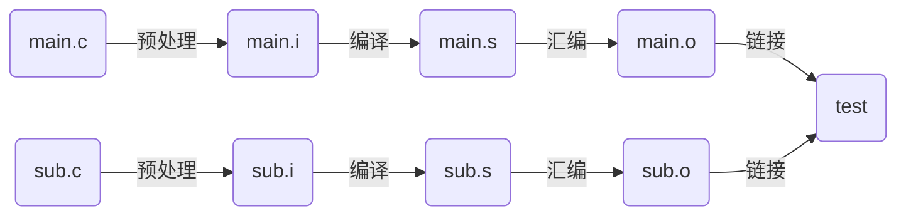
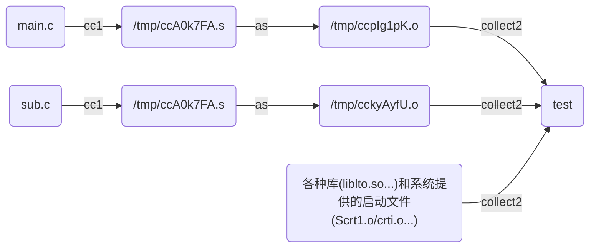
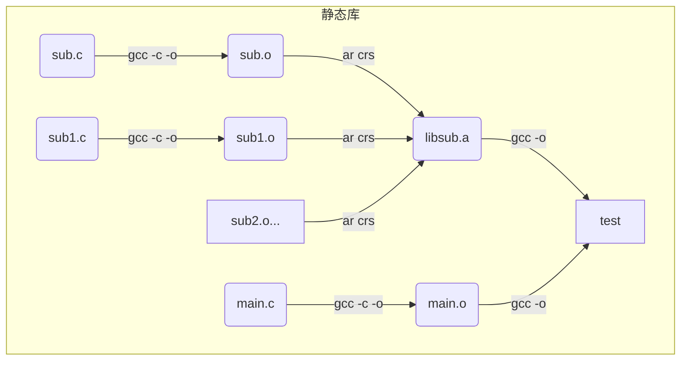
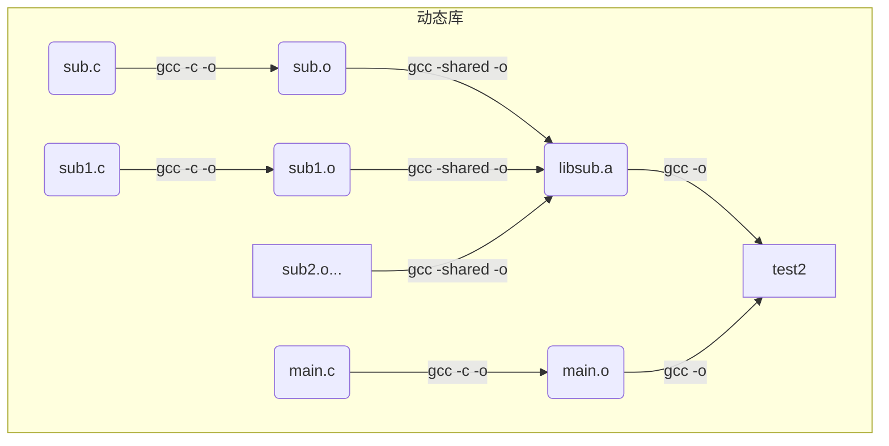
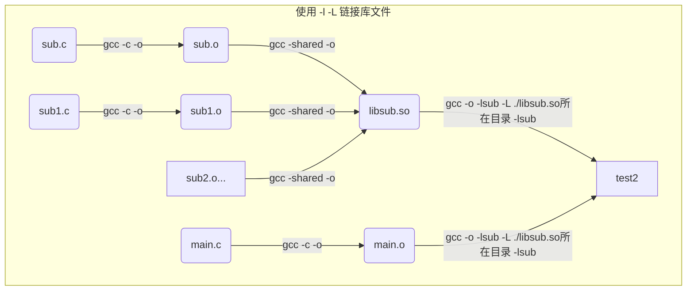

# GCC常用选项

---

## 多文件编译

### 常用编译选项

|选项|描述|
|-|-|
|-E|预处理, 开发过程中想快速确定宏可以使用`-E`或`-dM`|
|-c|预处理、编译、汇编, 但不链接|
|-o|指定输出文件|
|-I|指定头文件目录|
|-L|指定链接时的库文件目录|
|-l|指定链接的库文件|

### 源程序内容

main.c:

```C
#include <stdio.h>
#include "sub.h"

int main(int argc, char *argv[])
{
    int i
    printf("main fun! \n");
    sub_fun();
    return 0;
}
```

sub.h:

```C
void sub_fun(void);
```

sub.c:

```C
void sub_fun(void)
{
    printf("sub fun! \n");
}
```

### 编译及执行结果

```shell
finchee@linux-server:~/Documents/嵌入式linux应用开发基础/02_options/02_multi_file$ gcc -o test main.c sub.c
sub.c: In function ‘sub_fun’:
sub.c:3:5: warning: implicit declaration of function ‘printf’ [-Wimplicit-function-declaration]
    3 |     printf("sub fun! \n");
      |     ^~~~~~
sub.c:1:1: note: include ‘<stdio.h>’ or provide a declaration of ‘printf’
  +++ |+#include <stdio.h>
    1 | void sub_fun(void)
sub.c:3:5: warning: incompatible implicit declaration of built-in function ‘printf’ [-Wbuiltin-declaration-mismatch]
    3 |     printf("sub fun! \n");
      |     ^~~~~~
sub.c:3:5: note: include ‘<stdio.h>’ or provide a declaration of ‘printf’
finchee@linux-server:~/Documents/嵌入式linux应用开发基础/02_options/02_multi_file$ ./test
main fun! 
sub fun! 
```

GCC 的处理流程:



可以使用 `-v` 选项查看详细编译过程, 此处仅展示关系并说明要点:



1. `cc1` 将 main.c 和 sub.c 转换成的临时文件(/tmp/ccA0k7FA.s)可以同名
2. 需要编译的源文件过多时, `-o` 选项不适合修改单个文件后再编译使用, 只需要使用 `-c` 选项先编译, 再使用 `-o` 选项链接所有文件即可.
3. 预处理过程中
   - 使用 `"..."` 引用的头文件会在当前目录下查找
   - 使用 `<...>` 引用的头文件会在系统或编译工具链指定的目录下查找
   - 找不到头文件时, 通过 `-I` 选项为头文件增加指定搜索的目录, 或这把头文件放入系统/工具链指定的目录中

### 制作、使用动态或静态库

sub.c 可以作为静态库或动态库使用







1. 静态库链接时会和 main.o 打包在一起生成 test, 体积比动态库链接生成的 test2 大
2. 使用 `-l+库名` 选项链接库时, 如果找不到文件, 需要使用 `-L` 选项将 libsub.so 所在目录添加到 `LIBRARY_PATH` 中
3. 使用 `file` 命令查看两种链接方式产生的 test 文件, 都为动态链接(dynamically link), 是因为静态链接方式除了静态链接到 libsub.a , 还会动态链接其他库
4. 执行 `./test2` 时会提示找不到动态库, 链接和执行是两个不同的概念, 需要为执行指定库的路径:
   1. 将动态库放入系统指定的路径(/lib /usr/lib ...)
   2. 用户指定的路径
      1. 让 LD_LIBRARY_PATH 等于原来的值加上新的值
        > export LD_LIBRARY_PATH = $LD_LIBRARY_PATH:./

### 总结

|文件|备注|查找位置|
|-|-|-|
|头文件|<...><br>"..."|1.系统指定的头文件目录<br>2.`-I`指定dir|
|库文件|-lxxx|1.系统指定的lib目录<br>2.`-L`指定dir|
|执行|.so|1.系统指定的路径(/lib /usr/lib ...)<br>2.使用环境变量`LD_LIBRARY_PATH`指定|
